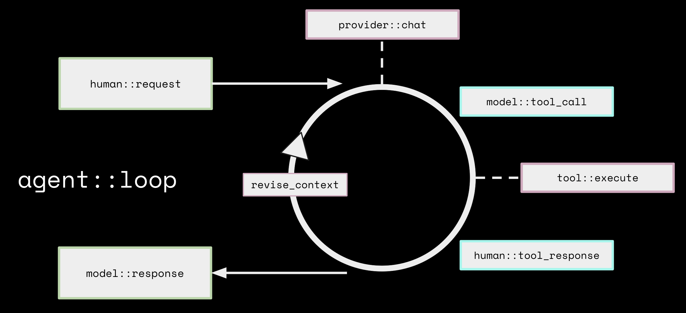

# Goose Architecture

Goose, an open source AI Agent, builds upon the basic interaction framework of Large Language Models (LLMs), which primarily functions as a text-based conversational interface. It processes text input and generates text output. This "text in, text out" approach is enhanced with tool integrations, which allows the AI agent to complete task, creating Goose.

## Goose Components
Goose operates using three main components, the **interface**, the **agent**, and the **connected [extensions](/docs/getting-started/using-extensions)**.

1. **Interface**: This is the desktop application or CLI that the user is using to run Goose. It collects input from the user and displays outputs to the user
2. **Agent**: The agent runs Goose's core logic, managing the interactive loop. 
3. **Extensions**: Extensions are components that provide specific tools and capabilities for the agent to use. These tools enable Goose to perform actions such as running commands and managing files.

In a typical session, the interface spins up an instance of the agent, which then connects to one or more extensions simultaneously. The interface can also create multiple agents to handle different tasks concurrently. Extensions and the interactive loop are important parts of Goose's functionality. The next sections will explain how Goose connects to extensions and processes user requests.

## Interoperability with Extensions
[Model Context Protocol (MCP)](https://modelcontextprotocol.io/) is an open standard that allows for interoperability between data sources and AI agents. Goose utilizes MCP to connect to [MCP systems/servers](https://github.com/modelcontextprotocol/servers?tab=readme-ov-file#model-context-protocol-servers). In Goose, these systems/servers are referred to as extensions.

Extensions expose their funtionality to Goose through tools. Tools are the functions that allow extensions to perfrom specific actions, such as running commands, or performing file operations. For example, the Google Drive extension includes a tool for searching documents. That tool is what gives Goose the ability to perform that action.

Goose comes with a set of [built-in extensions](/docs/getting-started/using-extensions#built-in-extensions), each designed to enhance your interaction. These include tools for development, web scraping, automation, memory, and integrations with JetBrains and Google Drive. Goose also supports [connecting to external extensions](/docs/getting-started/using-extensions#adding-extensions) or [creating custom extensions](/docs/guides/custom-extensions) as MCP servers. 

To learn more about the design and implementation of extensions and tools, refer to the [Extensions Design Guide](/docs/goose-architecture/extensions-design#tools). 

## Interactive Loop

Lets take a closer look at the interactive loop shown above.  

1. **Human Request** 
The process begins and ends with you. Once you give Goose a request, question, command, or problem to solve, the flow begins.

2. **Provider Chat** 
Goose sends your request along with a list of available tools to the [LLM provider](/docs/getting-started/providers) you've connected. The provider processes it, and if necesarry, creates a tool call as part of its response.  

3. **Model Extension Call** 
The LLM is capable of creating a tool call request but not able to execute it, that's when Goose steps in. Goose takes the tool call which is formattted in JSON, runs it, and gathers the results.

4. **Response to Model**
After executing the tool call, Goose sends the results back to the model. If more extensions are needed, those steps will repeat.

5. **Context Revision** 
Goose will remove any old or irrelevant information, ensuring the LLM focuses solely on the information that matters the most. This helps with token management.  

6. **Model Response** 
Once all the tool calls are done, the LLM sends a final response back to you and restarts the loop once you respond.

## Error Handling in Goose

As opposed to allowing an error to break the flow, Goose captures and handles traditional errors along with execution errors. Errors such as invalid JSON, missing tools, etc. are sent back to the model as tool responses giving the LLM the information it needs to resolve the error and continue. 

For more details on how Goose handles errors, refer to the [Error Handling in Goose](/docs/goose-architecture/error-handling) Guide.

## Context Revision: Token Management

While Goose is free and open source, there is typically a cost associated with LLM token usage. Everything competes for token usage including messages, tool requests, resources, file content, instructions, etc. This is where Content Revision comes into play to help reduce some of those costs. There are a few things that are done to assist with this:
* Goose summarizes with faster and smaller LLMs
* Goose includes everything versus a semantic search
* Goose uses algorithims to delete old or irrelevant content
* Goose will use find and replace instead of rewriting large files, use ripgrep to skip system files, and summarize verbose command outputs 

